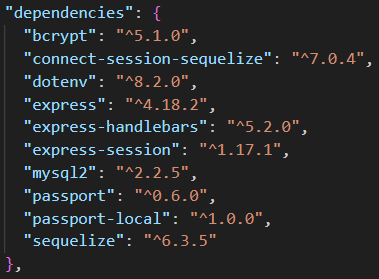

# Book Review App

## Description

Welcome to our Book Club Platform, a haven for book enthusiasts seeking literary inspiration and discovery. Explore an extensive collection of books spanning diverse genres and written by talented authors. Stay engaged with our community of readers and writers, sharing book reviews, recommendations, and engaging discussions. Embrace the joy of reading, connect with fellow book lovers, and unlock the door to captivating stories within our Book Club Platform.

## Languages and Technologies Used

Front-end: HTML, CSS, JavaScript

Back-end: Node.js, Express.js, MySQL, Handlebars.

This app also uses the following npm dependencies:

## Table of Contents (Optional)

- [Installation](#installation)
- [Usage](#usage)
- [Credits](#credits)
- [Contributing-Guidelines](#contributing-guidelines)
- [Future-Development-Goals](#future-development-goals)
- [Tests](#tests)
- [License](#license)
- [Questions](#questions)

## Installation

1. Clone the repo into the desired location using the terminal command: `git clone https://github.com/jeffrpar/book-review.git`

2. Open the local repository using VS Code. If you do not have VS Code installed, you can download it here: https://code.visualstudio.com/

3. Use the VS Code terminal and type `npm i` to install the dependencies required by the application.

4. Rename `.env.EXAMPLE` to `.env` and enter your MySQL password into the `DB_PASSWORD` field. You can learn more about setting up MySQL here: https://dev.mysql.com/doc/mysql-getting-started/en/

5. Now that the application can connect to MySQL, you must create database using the schema.sql file. Using the terminal from the app directory, type `mysql -u root -p` which will prompt you for your MySQL password. Once your password is submitted, type `source db/schema.sql;` which will create a database for the app to use. Type `exit` to exit from MySQL in the terminal.

6. Insert data into the database by typing the command `npm run seed` into the terminal, which will run a script to seed data.

7. You can then use the command `npm start` to run the application on a local server.

## Usage

This app can be used to look up book recommendations and purchase recommended books through amazon links.

## Contributing-Guidelines

We welcome and appreciate contributions from the community! Whether you want to fix a bug, add new features, or improve documentation, your contributions are valuable in making this project better.

To ensure a smooth and collaborative development process, please follow the guidelines below when making contributions:

**Getting Started**

1. Fork the repository on GitHub.

2. Clone your forked repository to your local machine.

**Making Changes**

3. Create a new branch from the main branch to work on your changes.

4. Make your changes, following the code style and guidelines.

5. Commit your changes with a descriptive commit message.

**Code Style and Guidelines**

Please follow our coding conventions and style guidelines when writing code. If unsure, refer to existing code for examples.
Testing

Ensure that your changes pass all existing tests. If you're adding new features, include appropriate test cases.

**Submitting a Pull Request**

6. Push your changes to your forked repository.
7. Submit a pull request (PR) to the main branch of this repository.
8. Provide a detailed description of your changes in the PR. **Ensure your PR's title and description are clear and descriptive.

**Code Review**

Your pull request will be reviewed by the maintainers, who may provide feedback or request changes before merging.

## Future-Development-Goals

Add functionality to allow users to score books and leave comments on reviews.

Add routes to user profiles where other users can see a user’s comments and other activity.

## Tests

There are currently no tests written for this app.

## License

Please refer to the GNU General Public License v3.0 information [here](https://www.gnu.org/licenses/gpl-3.0.en.html#license-text).

## Questions

Github profile: [https://github.com/jeffrpar](https://github.com/jeffrpar).

If you have any additional questions about this application, please reach out to me via email at [jeffrpar@gmail.com](jeffrpar@gmail.com).

On the landing page for the app, we would show books that have been reviewed, which the user would be able to interact with to get more info. There will also be a page for a user profile, so that a user can see info about other users such as their reviews and comments. We would also like to include a settings page for the user to update the information such as name or password.
